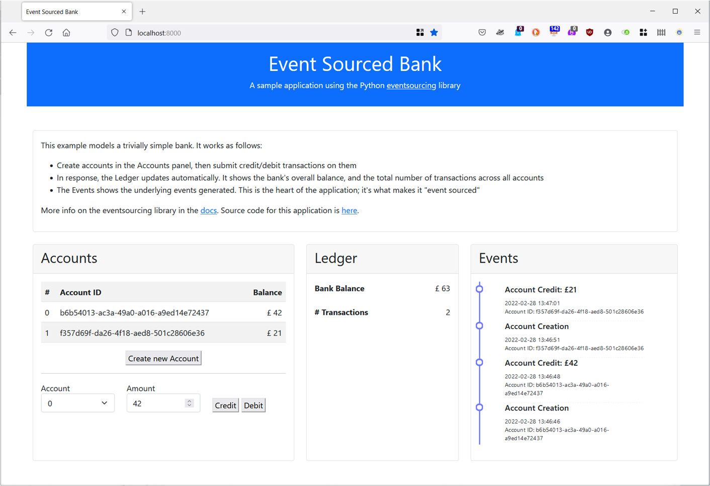

# Event Sourced Bank

A "wide but shallow" example of using the Python [event sourcing library](https://github.com/pyeventsourcing/eventsourcing).  "Wide" in the sense that it covers most features in the library; "shallow" in the sense that the use of each is trivial.  It's purpose is not to be an authentic bank: it's to demonstrate the various library components in an example where the domain model itself affords no learning curve.

## Overview

The domain model is simple. It comprises only 2 classes, both in the [domain model](event_sourced_bank/domain_model.py) file.  `Account` models a trivial bank account as an event-sourced [Domain-Driven Design](https://en.wikipedia.org/wiki/Domain-driven_design) Aggregate.  `Ledger` is an equally simple abstraction of a ledger, again modelled as a DDD Aggregate.  

The idea is that all transactions on all accounts get recorded in the ledger:  

* Each transaction on each account generates an event;
* The ledger listens to those events, and is updated accordingly.

## Implementation

The `Account` and `Ledger` aggregates are implemented using the `eventsourcing` library's [Aggregate](https://eventsourcing.readthedocs.io/en/latest/topics/domain.html) base class.

Each aggregate is wrapped in a service.  The [AccountService](event_sourced_bank/account_service.py) uses the `eventsourcing` library's [Application](https://eventsourcing.readthedocs.io/en/latest/topics/application.html) class, and provides an API for creating/retrieving accounts and then acting on them.  The [LedgerService](event_sourced_bank/ledger_service.py) is implemented using the library's [ProcessApplication](https://eventsourcing.readthedocs.io/en/latest/topics/system.html).  Its purpose is to follow all transactions on all accounts, so a single ledger tracks the overall balance in the bank.

The [EventSourcedBank](event_sourced_bank/bank_system.py) class ties everything together.  It wires the `AccountService` and `LedgerService` together, so transactions on `Accounts` are recorded in the `Ledger`.  There's a minimal [main](main.py) that creates a system and runs a few transactions through. 

### Snapshots 

The `eventsourcing` lib reconstructs aggregates from the events that create and evolve them.  That's consistent with the fundamental notion of [event sourcing](https://martinfowler.com/eaaDev/EventSourcing.html): store the events that change state over time, rather than storing the current state directly.  It can, however, give rise to a performance problem with *long-running aggregates*.  Each time an aggregate is retrieved, it is re-constructed from its event history.  See, for example, the calls to `repository.get(account_id)` in the [AccountService](event_sourced_bank/account_service.py).  That history grows monotonically over time.  Reconstructing the aggregate therefore takes proportionally longer as the aggregate evolves.

The library provides **snapshots** as a way to deal with this issue.  It's as the name suggests; snapshots store the aggregate's state at given points.  Re-constructing from a snapshot therefore removes the need to iterate over history prior to the snapshot being taken.  Snapshots are well explained in the [docs](https://eventsourcing.readthedocs.io/en/stable/topics/application.html#snapshotting) so not worth repeating here.  Suffice to say there are various options that cover the spectrum from simple defaults to highly configurable options.

Given that this example app intends to be "wide and shallow", it's appropriate to include the snapshotting construct.  It's equally appropriate to use the *simplest thing that could possibly work*.  Hence each of the services ([AccountService](event_sourced_bank/account_service.py), [LedgerService](event_sourced_bank/ledger_service.py)) employ [automatic snapshotting](https://eventsourcing.readthedocs.io/en/stable/topics/application.html#automatic-snapshotting).  That's enabled by a single line of code in each class; e.g. 

      class AccountService(Application):
         snapshotting_intervals = {Account: 50}

That one line means a snapshot will be taken automatically every 50 events for each aggregate instance.

## Installation

1. Clone this repo:

        $ cd /my/projects/dir
        $ git clone https://github.com/sfinnie/event_sourced_bank.git
        $ cd event_sourced_bank

2. (optional but recommended): create a virtual environment:

        $ python3 -m venv venv
        $ source venv/bin/activate

3. Install dependencies

        $ python3 -m pip install -U pip
        $ python3 -m pip install eventsourcing pytest 

4. (optional): if you want to run the web app (see below), there are extra dependencies

         $ python3 -m pip install fastapi jinja2 uvicorn[standard] python-multipart

## Running

There's a minimal, trivial, script to create a bank and run some sample transactions through:

      $ python3 run_sample.py

There's also a web-based app that allows accounts to be created and transacted on.  It shows the 
ledger updating accordingly, and the events being generated in thr underlying system.  To run it:

      $ python3 main.py

## Testing

There are a few tests, more as examples than a comprehensive test suite at the moment.  To be enhanced.  To run:

    $ pytest

